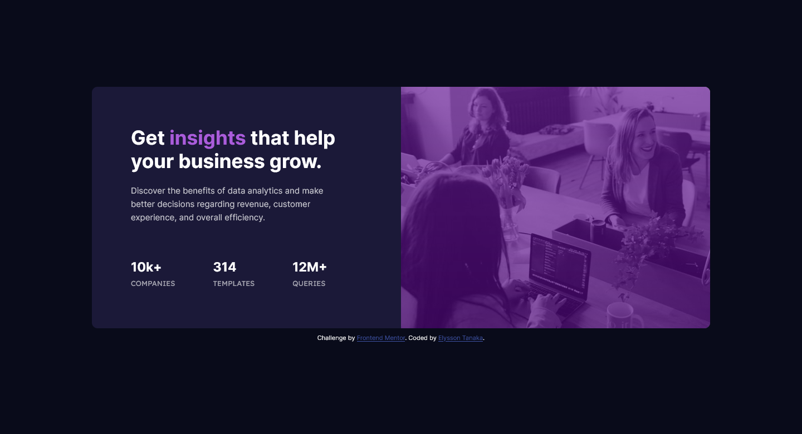

# Frontend Mentor - Stats preview card component solution

This is a solution to the [Stats preview card component challenge on Frontend Mentor](https://www.frontendmentor.io/challenges/stats-preview-card-component-8JqbgoU62).

## Table of contents

- [Overview](#overview)
  - [The challenge](#the-challenge)
  - [Screenshot](#screenshot)
  - [Links](#links)
- [My process](#my-process)
  - [Built with](#built-with)
  - [What I learned](#what-i-learned)
- [Author](#author)

## Overview

### The challenge

Users should be able to:

- View the optimal layout depending on their device's screen size

### Screenshot

### Links

- Solution URL: [Add solution URL here](https://your-solution-url.com)
- Live Site URL: [https://elyssontanaka.github.io/3_stats_preview_card_component/](https://elyssontanaka.github.io/3_stats_preview_card_component/)

## My process

### Built with

- CSS variables
- Flexbox
- Mobile-first workflow

### What I learned

Working on this project I was not too concerned about getting the design as perfect as possible, but instead I focused more on the responsiveness part. Thinking of the card as a component, I've tried to use flex to position the elements on the screen instead of using position relative and absolute as I used to. Also, this is the first project I've built with mobile-first workflow in mind.
From this project on I'll try to use rem and em instead of px for fonts, margins, paddings, etc.

## Author

- Website - [Elysson Tanaka](https://elyssontanaka.github.io)
- Frontend Mentor - [@yelyssontanaka](https://www.frontendmentor.io/profile/elyssontanaka)
